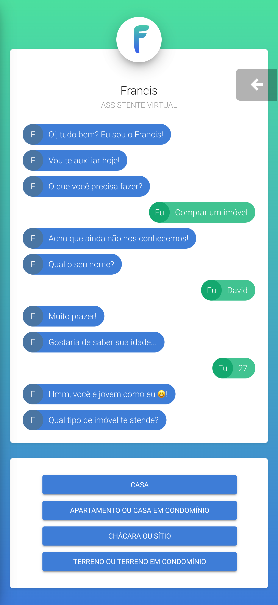

# Francis

O Francis é um chat onde o usuário poderá ter a experiência de procurar imoveis, relatar
problemas no imovel, avaliar um imovel etc.




Desenvolvido pelo Time Super Devs: (melhor Time)

1. [David Gabriel](https://github.com/David10Gabriel)
2. [Fábio Rodrigues](https://github.com/fabiordrig)
3. [Luana Andare](https://www.linkedin.com/in/luana-andare/)
4. [Lucas Salvador](https://github.com/LASalvador)

> **Para utilizar o PWA no chrome não esqueça de habilitar o modo Mobile no navegador
> através do modo ferramenta de desenvolvedor**

> O projeto utiliza framework VueJS logo para utilizá-lo é necessário ter instalado:
> nodejs e yarn

> Só é possível rodar o projeto com a versão 16 do node

## Project setup

```bash
yarn install
```

### Compiles and hot-reloads for development

```bash
yarn run serve
```

### Compiles and minifies for production

```bash
yarn run build
```

### Run your tests

```bash
yarn run test
```

### Lints and fixes files

```bash
yarn run lint
```
